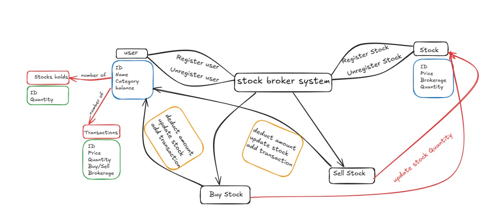

# STOCK BROKER SYSTEM

- A C++ program that models a stock brokerage system where users can perform buy/sell transactions.
- I am attaching a PDF FILE for Functionalities.
- I am also attaching a FlowChart in form on image(.jpg file).

## 1.Functionalities

I am dividing the functionalities into two types : 

- **Must-have Functionalities:** These are essential features needed for core operations
- **Nice-to-have Functionalities:** These are additional features that enhance usability and provide extra value. 

### Must-have Functionalities
- **Register User:** It allows broker to add new user.
- **Unregister User:** It allows broker to delete a user.  
- **Stock Holds:** Number of Stocks a single user is Holding.
- **Register Stock:** It allows broker to add new stock.
- **Unregister Stock:** It allows broker to add delete a stock.
- **Buy Stock:** It facilitates users in purchasing stocks with the help of broker, ensuring sufficient balance and updating stock holdings.
  - Deducts amount
  - Updates stocks the user is holding
- **Sell Stock:** : It allows users to sell stocks with the help of broker, ensuring they have sufficient stock to sell and updating their balance accordingly.
  - Adds amount
  - Updates stocks the user is holding
- **Update Stock:** It is used to update the Stock Price

### Nice-to-have Functionalities
- **Transaction History Retrieval:** Stores each user’s transactions, whether buying or selling.
- **Balance Inquiry:** Allows users to check their remaining balance with the broker’s help.
- **Brokerage Charges Display:** Shows users the total brokerage charges they have incurred.
- **Display Stock Information:** Provides users with stock details, including brokerage charges
- **Display User Information:** Allows users to view their account information.
- **Balance Notification:** Alerts users when their balance drops below a specified limit.

## 2.Flowchart



## 3.How do the User,Stock,Transaction and StockBroker classes interact with each other in the stock brokerage system ?
- Basically , The StockBroker class acts as the main controller
- The StockBroker class registers and handles User objects by storing them in a map and for each transaction the StockBroker retrieves the User by their userId, checks their balance or stock holdings and updates their balance and stock holdings according to it.
- The StockBroker class registers and handles Stock objects by storing them in a map and during a transaction, it retrieves the Stock by stockId checks if there is enough stock available and updates the stock quantity after a buy or sell transaction.

## How to Run

You can run this C++ program using the following methods:

### 1. Running Locally in VS Code

- Open the `.c++` file in **Visual Studio Code (VS Code)**.
- Make sure you have the **C++ extension** installed. If not, you can install it from the Extensions Marketplace.
- **Compile and Run**:
  - Open a terminal in VS Code.
  - Run the following command:
    ```
    g++ filename.cpp -o anyname
    ./anyname 
    ```

### 2. Running Online

You can also run this program in an online compiler like [OnlineGDB](https://www.onlinegdb.com/online_c++_compiler). Just paste the code into the editor and click "Run" to execute the program without needing to install anything locally.
